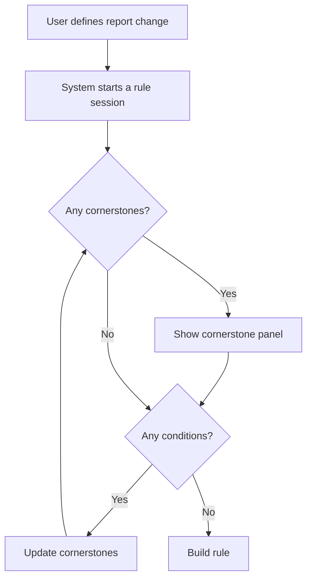

# Building a rule using the chat interface

## What do we want to achieve?

We want to allow the user to build a rule, including the review the cornerstones, using the chat interface, rather than
having to use the UI components to do this review.

Once the report action has been defined (add, remove, or replace a comment), the user can then define the conditions for
the rule and review the cornerstones.

The user actions for each cornerstone case are:
- allow the report of the cornerstone case to change once the new rule is added, or
- add further conditions to the rule to exclude the cornerstone case from the rule action, or
- cancel the review of the cornerstone cases

## Conversation design

The summary workflow is as follows:

