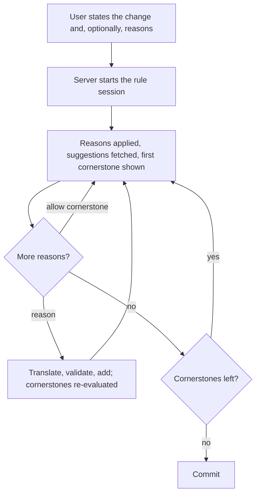

# Chat architecture

Requirements: [chat.md](../requirements/chat.md), [rule_building.md](../requirements/rule_building.md).

## The principle: the model understands, the server decides

The chat lets an expert say what they want in their own words; a language model works out what they mean. But a
knowledge base is clinical knowledge, so nothing the model says is trusted:

- the model emits a **structured action**; the server validates every argument (a name resolves, a comment exists, a
  condition holds for the case, no cycle is created) before doing anything;
- the model **transcribes** names, comment texts, value expressions and reasons exactly as the user wrote them, so that
  the server can ask about a near match rather than have the model silently "correct" it;
- suggestions, cornerstone status and rule commits come from deterministic code; the model only relays and selects;
- anything irreversible is confirmed in words, by the server.

The reviewer's summary in [../reviews/design_review_2026-08.md](../reviews/design_review_2026-08.md) holds: the KB is
protected by semantics, not by prompt discipline.

## Two conversations

Both are server-side Gemini chats; the client never talks to a model.

| Conversation   | Owner                                                 | Job                                                                                                                          |
|----------------|-------------------------------------------------------|------------------------------------------------------------------------------------------------------------------------------|
| **Operator**   | `ChatManager` (one, held by `ChatCoordinator`)        | Understands the user's request, asks clarifying questions, emits actions, relays server results.                             |
| **Translator** | `ConditionChatService` (one per `RuleSessionManager`) | Turns one natural-language reason into a `ConditionSpecification`; see [condition_translation.md](condition_translation.md). |

Keeping them separate keeps each prompt small and single-purpose. Gemini is used for both because the client and key
were already in place; a second provider would buy little for the operator's task.

## The operator conversation

### Context

A conversation is built for a `ChatContext`: no knowledge base, a knowledge base with no case, or a case in a knowledge
base. The context selects the system-prompt sections, the functions the model may call (none without a case), which
actions make sense, and the greeting. Without a case the greeting is fixed server text: it exists to tell the user
exactly what they can do next, so it should not vary run to run.

The **client** starts a conversation whenever its context changes (KB opened or closed, case selected); the server never
does, because after an open or create the server only pushes state, and if it also restarted the conversation the
client's own cascade would start a second one and the greetings would race. A message arriving while the next
conversation is starting waits on a mutex in the coordinator.

### Protocol

The system prompt is assembled from numbered Markdown sections under `server/src/main/resources/chat/instructions/`,
with placeholders for the KB's names, the case's attribute names and its current comments. Attribute *values* are not
sent: the operator model never needs case data, and the translator has what it needs.

The model communicates three ways:

| Mechanism                              | Used for                                                                                                                                                                                    |
|----------------------------------------|---------------------------------------------------------------------------------------------------------------------------------------------------------------------------------------------|
| Native function calls                  | `transformReasonToFormalCondition`, `getSuggestedConditions`, `selectSuggestedCondition` — the three calls that must return a result to the model mid-turn                                  |
| A JSON action object in the reply text | every state change: `AddComment`, `CommitRule`, `OpenKnowledgeBase`, … The JSON is extracted from the prose (`ActionComment`) and bound by reflection to the action class of the same name. |
| Plain text                             | questions and explanations, shown to the user                                                                                                                                               |

`Action` is a sealed interface: `ChatAction`s work on the open KB and case through `RuleService` (implemented by
`RuleSessionManager`), `KbManagementAction`s work on the set of KBs through `KnowledgeBaseService`, and
`ListCapabilities` needs neither. `ChatManager` dispatches on kind and refuses a `ChatAction` when no KB is open.

`SuggestionsBuffer` holds the suggestion list the model fetched, so the model never has to echo the list back; the
chips are attached to the response deterministically. Suggestions already in the rule are filtered where the response is
assembled (`ChatResponseEnricher`), because the model may fetch before it selects within one turn.

### Server-held state

`ChatManager` is a mediator; three delegates own policy and are unit-tested directly:

| Delegate                    | State                                                                               | Owns                                                                                         |
|-----------------------------|-------------------------------------------------------------------------------------|----------------------------------------------------------------------------------------------|
| `KnowledgeBaseConversation` | `Idle`, `Greeting`, `Creating(stage, question, actionForName)`, `Confirming(offer)` | KB greeting, the naming workflow for a new KB or demonstration copy, one-turn confirmations. |
| `RuleConversation`          | `Ready`, `OfferedAssignment(action)`, `AwaitingReasonReply`                         | The "more reasons?" question, "did you mean" offers, cornerstone allow replies.              |
| `ChatResponseEnricher`      | one flag                                                                            | Suggestion precedence and filtering; the once-per-conversation comment-variable tip.         |

These are guards on specific transitions, not a rule-building state machine: `RuleService` remains the single authority
on whether a session is active and what the cornerstone status is. Sealed types and exhaustive `when`s make the pending
server question explicit without a framework.

**The server holds every confirmation.** An action needing the user's say-so returns a question and a lambda that has
already captured the resolved target; a plain acceptance runs the lambda without consulting the model, anything else
drops it. The model is told never to ask for confirmation itself, and a lambda gives it nothing to name to skip the
question. The acceptance-word check runs before the model for a server question, since a model that did not ask the
question would answer "yes" with a clarification.

**Server-owned workflow, model-interpreted language.** Where the reply to a server question is not a plain yes — "call
it Thyroid", "no", "actually, open Zoo" — the reply, the question and the stage go to the model, which returns an intent
(`CONFIRM`, `DENY`, `CONFIRM_WITH_NAME`, `UNCLEAR`, `OTHER_REQUEST`) and any name verbatim; the server chooses the
transition. This handles any language without an acceptance-word list per language.

Dispatch order each turn: explicit cornerstone allowance, KB workflow reply, accepted assignment offer, then the model.

## The rule-building workflow

1. **Report change.** The model reads the action from the user's message; an unquoted comment is read back for
   confirmation. It emits the action, optionally with a `reasons` array containing the reasons verbatim.
2. **Session start.** The action calls `RuleService.startRuleSessionTo…`, which validates and creates the
   `RuleBuildingSession`. Any reasons are applied at once through the same path a typed reason takes, each succeeding
   or failing on its own, and the cornerstone status is pushed once. The result — cornerstone count, what was added,
   what was not understood — is fed back to the model as a turn, with a directive to fetch suggestions and not to ask
   for a first reason.
3. **Reasons.** A typed reason goes to the translator through the `transformReasonToFormalCondition` function;
   `RuleSessionManager.conditionForExpression` validates it. A clicked chip goes through `selectSuggestedCondition`.
   After a turn that added conditions, `RuleConversation` replaces the model's message with the server's own
   acknowledgement in canonical form (`Added your reason 'Glucose is high'`) and the question "Do you want to provide
   any more reasons?", so the user sees how their words were read and the expert decides when to stop. The server's
   question is sent with the next reply as context, since the model's own history may hold a different question.
4. **Cornerstones.** Each change to the conditions re-evaluates the cornerstones to the fixpoint; the panel shows the
   first survivor. "Allow" is recognised on the server and exempts it; a new reason that is false for it excludes it.
   Every user message during a session is prefixed with the current cornerstone status, so the model cannot drift on
   the count. When the count reaches zero and the user has declined more reasons, `CornerstoneReviewMessage` appends
   an imperative to commit, because without it the model loops back to offering suggestions.
5. **Commit.** `CommitRule` adds the rule and the case becomes a cornerstone. `CancelRule` discards the session;
   `UndoLastRule` (after `ShowLastRuleForUndo`) removes the last committed rule.

Why the acknowledgement is composed where the reasons are applied rather than by the turn-completion check: the
session-starting action's feedback to the model is a nested turn, and by then the conditions it added are already the
baseline, so the completion check sees nothing new. One shared phrasing keeps "a reason was added" said one way.

## Why not a state machine in code

The reviewer recommends moving the phases into code and offering the model only the tools legal in the current phase.
The current design deliberately stops short: the delegates above guard the transitions that were observed to go wrong,
while the model keeps the flexibility to handle "actually, remove that reason and show me the second cornerstone" in
one turn. If prompt maintenance across model versions becomes the dominant cost, that is the direction to take, and the
delegates are where the phases would go.

## The user interface

The chat panel is a message list (model left, user right) with a text field, a microphone button
([voice_input.md](voice_input.md)) and, when the server attaches them, suggestion chips, a clickable KB list or a
capability card ([chat_ui_guidelines.md](chat_ui_guidelines.md)). The cornerstone under review is shown in the case
area, not in the transcript: a pathologist should compare data in a table, not read a case out of prose.
