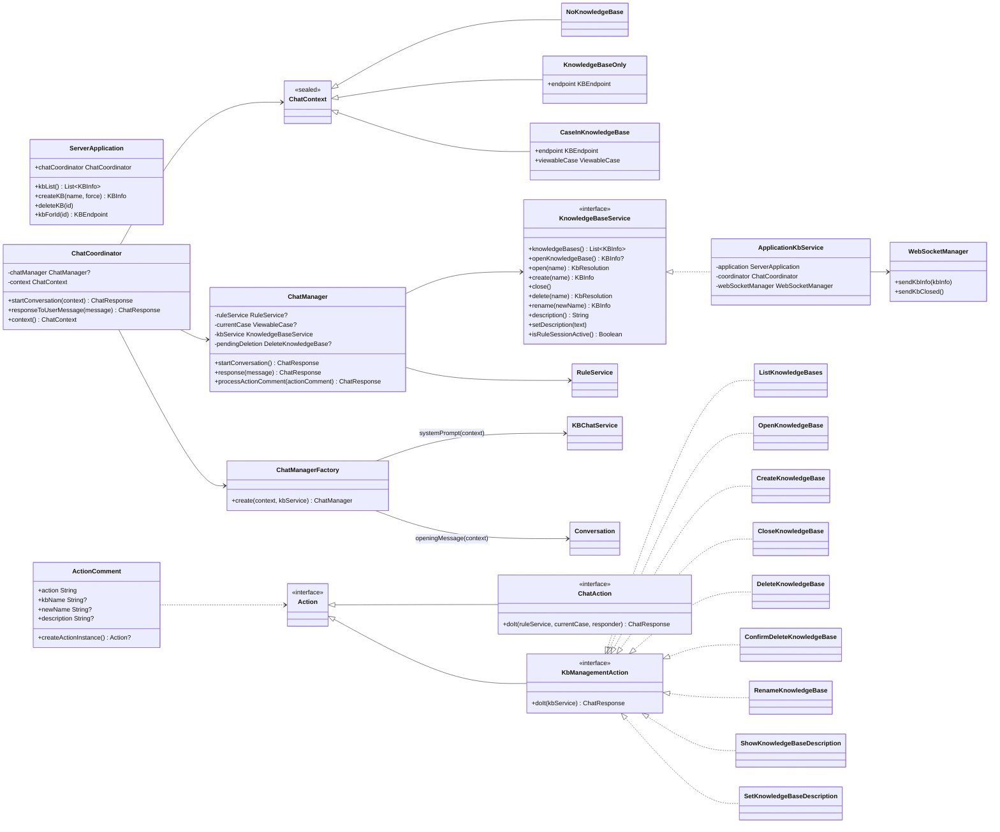
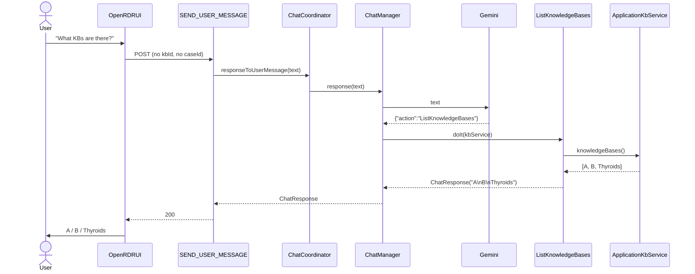
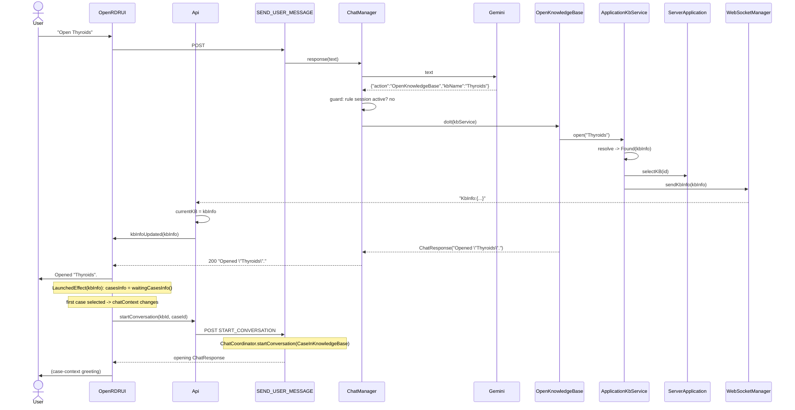
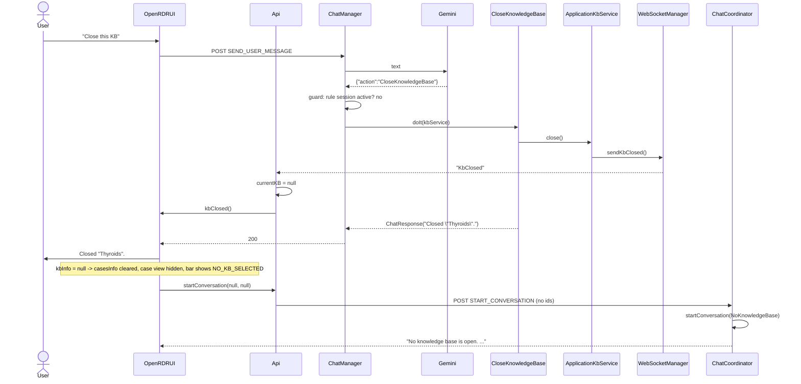
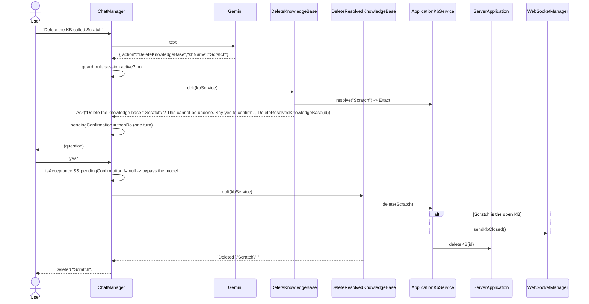
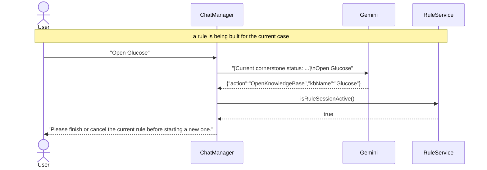

# Managing knowledge bases through the chat

## Summary

The user should be able to **list**, **create**, **open**, **close**, **delete**, **rename** and **describe** knowledge
bases by talking to the chat, in the same way that they already add comments, build rules and copy cases. Today those
operations live only in the KB anchor menu on the application bar (`KbAnchorMenu`), and "close" and "delete" do not
exist at all: the server's
`ServerApplication.deleteKB` is a `TODO()` and the client always has some KB selected.

The chat today is bound to a *case*: a `ChatManager` is created per case selection, inside the `KBSession` of one KB,
and the client refuses to send a message unless a case is showing. KB management is the one family of operations that
must work *above* a KB - when the KB has no cases, and when no KB is open at all. So the heart of this design is to move
ownership of the conversation up one level, from `KBSession` to the application, and to make the conversation's context
explicit: *no KB*, *a KB with no case*, or *a KB and a case*.

The chosen shape, in one paragraph:

- **One conversation, one model.** KB management is a set of extra actions in the *same* system prompt, not a second
  "router" LLM in front of the KB chat. The abandoned branch `kb_management_by_chat` built the two-tier router and it
  costs two model calls per turn, loses conversational context at the hand-off, and duplicates the action-dispatch
  machinery. We do not take that part of the branch.
- **The server decides, the model transcribes.** The model emits `{"action": "OpenKnowledgeBase", "kbName": "..."}`; the
  server resolves the name, refuses ambiguity, asks for confirmation before a delete, and refuses a context switch while
  a rule is being built. No policy lives in the prompt.
- **The GUI follows the server over the web socket**, exactly as it already does for cases and cornerstones (see
  `updating_the_gui_from_the_server_state.md`). Opening a KB from the chat pushes the new `KBInfo` to the client; the
  client's existing cascade (`kbInfo` -> cases -> first case -> `startConversation`) does the rest. Closing pushes a
  `KbClosed` event.

The acceptance tests are the cucumber scenarios in `requirements/kb/Knowledge Base management by chat.feature`
(section 6), and the work is staged so that each stage leaves the tree green (section 7).

### What is taken from the branch, and what is not

| Branch artefact                                                                                                     | Decision                                                                                                                         |
|---------------------------------------------------------------------------------------------------------------------|----------------------------------------------------------------------------------------------------------------------------------|
| `Manage knowledge bases using chat commands.feature` (list, open)                                                   | Reused as the seed of the new feature file; extended with create, close, delete.                                                 |
| `WebSocketManager.sendKbInfo`, `WebSocketApi.handleKbInfo`, `Api.startWebSocketSession(kbInfoUpdated)`              | Reused, but with a `KbInfo:` prefix like `CASES_INFO_PREFIX` instead of the branch's `contains("cornerstoneToReview")` sniffing. |
| `ServerApplication.kbInfoForName` (case-insensitive, then exact tie-break, `Result`)                                | Reused as the basis of name resolution (section 4.5).                                                                            |
| `ChatPO.mostRecentBotRowIs`, step `the chatbot response consists of the following lines:`                           | Reused.                                                                                                                          |
| `ServerChatManager`, `ServerAction`, `ServerChatServiceFactory`, second prompt `server/chat/instructions/1_task.md` | **Not taken.** Two-tier router; see above.                                                                                       |
| `KnowledgeBaseEditMessageAction` (forward the message verbatim to the KB chat)                                      | **Not taken.** Only needed by the router.                                                                                        |
| `runBlocking { startConversation(null, null) }` in `ServerApplication.init`                                         | **Not taken.** A conversation is started by the client, when the client is ready, as now.                                        |
| Moving `kb.chat.*` to `server.chat.*`                                                                               | **Not taken.** Churn without benefit; the packages stay where they are.                                                          |

## 1. Goals and non-goals

### Goals

1. From the chat, with or without a KB open: list the KBs; create a KB by name (and open it); open a KB by name.
2. From the chat, with a KB open: close it; delete it (or another KB by name) after confirmation.
3. The GUI reflects each change without the user touching the anchor menu: KB name in the bar, case list, chat context.
4. The chat panel is usable when the KB has no cases and when no KB is open. Today `sendUserMessage` throws if
   `currentCaseId` is null.
5. Deterministic behaviour for everything that matters: name resolution, ambiguity, confirmation, refusal during a rule
   session. These are unit-tested on the server without a model.
6. From the chat, with a KB open: rename it; show and replace its description. These are a later stage (section 7, stage
   6) because rename needs a small persistence addition; they use the same machinery as the first five.

### Non-goals

- Creating a KB *from a sample* by chat. The sample list is a closed set the GUI presents well; add later if wanted.
- Import/export by chat. Both need a file path, which is exactly what a text field is for.
- Editing a description *incrementally* ("add a line saying..."). The chat replaces the whole description; the GUI
  dialog remains the place for fine editing.
- Multi-client sessions. `WebSocketManager` holds one connection and the server has one chat; this design keeps that.

## 2. The current state, and what has to change

```
client                                server
------                                ------
OpenRDRUI                             ServerApplication
  kbInfo, casesInfo, currentCaseId      idToKBEndpoint: Map<String, KBEndpoint>
  LaunchedEffect(currentCaseId)         KBEndpoint(KBSession)
    -> api.startConversation(caseId)      KBSession(kb) { ruleSessionManager, chatSessionManager }
  chatControllerHandler                     ChatSessionManager.startConversation(viewableCase)
    -> api.sendUserMessage(msg, caseId!!)     builds Conversation + ChatManager per case
                                              ChatManager.processActionComment -> ChatAction.doIt(ruleService, case, responder)
```

Facts that shape the design:

- `Conversation.startConversation()` hard-codes the opening message *"Please assist me with the report for this case."*
  and `KBChatService.systemPrompt` requires a `ViewableCase`. Both must become context-dependent.
- `ChatAction.doIt(ruleService: RuleService, currentCase: ViewableCase?, modelResponder)` - `RuleService` is per-KB
  (`RuleSessionManager` implements it). KB management needs a service that is per- *application*.
- Actions are found by reflection: `ActionComment.createActionInstance()` looks up
  `io.rippledown.kb.chat.action.<action>` and binds constructor parameters by name from `ActionComment`'s fields. New
  actions therefore need only a class and (for the name) one new field, `kbName`.
- `ChatManager` already has the exact pattern we need for a confirmation held for one turn:
  `offeredAssignment` + `isAcceptance(message)`.
- The server has *no* notion of "the current KB": every request carries `kbId`. The client's `Api.currentKB` is the only
  "current KB" and `Api.kbInfo()` lazily fetches (and, via `getDefaultProject`, *creates*) the default KB when it is
  null. "Close" therefore needs the chat calls to stop going through `Api.kbInfo()`.
- The client's cascade on `kbInfo` change already restarts the conversation for the first case of the new KB. It does
  **not** start one when the new KB has no cases, and it does nothing on `kbInfo == null`.
- `KBManager.deleteKB(kbInfo)` and `PersistenceProvider.destroyKBPersistence` exist and are tested; only
  `ServerApplication.deleteKB` is missing (and the `DELETE_KB` route calls it).
- `KBManager.createKB(name, force = false)` refuses a duplicate name ignoring case. The GUI's `CREATE_KB` route passes
  `force = true`; the chat will pass `false` and report the clash.
- The description is already fully supported: `KB.setDescription` / `description()` via `MetaInfo`, and the
  `KB_DESCRIPTION` GET/POST routes.
- Renaming does not exist anywhere. `KBInfo.name` is a `val`; `KB.kbInfo` is read once from `PersistentKB.kbInfo()`;
  `KBManager.kbInfos` caches the infos. But the id - and the Postgres database name - is fixed at creation
  (`convertNameToId` runs once), so a rename is an update of the `name` column of `kb_info` plus a refresh of those two
  caches. `KBInfo.equals` is id-only, which makes replacing an entry in `kbInfos` trivial and, on the client, means a
  renamed `KBInfo` compares *equal* to the old one - a Compose `mutableStateOf` will not recompose unless the state uses
  `neverEqualPolicy()` (already done for `currentCase`, for the same reason with `Attribute`).

## 3. Design overview



The pieces, top to bottom:

- **`ChatContext`** (server, `io.rippledown.kb.chat`) - a sealed class naming the three situations the chat can be in.
  The prompt, the function declarations, the opening message and the set of acceptable actions all derive from it.
- **`ChatCoordinator`** (server, `io.rippledown.kb.chat`) - owns *the* `ChatManager` for the application and knows the
  context it was built for. Replaces `ChatSessionManager`, which goes; `KBSession` keeps only `ruleSessionManager`.
- **`ChatManagerFactory`** - the construction logic now in `ChatSessionManager.startConversation` (handlers, buffer,
  `Conversation`), generalised over `ChatContext`. Case-only collaborators (`KBReasonTransformer`,
  `SuggestedConditionsHandler`, `SelectSuggestionHandler`, the three function declarations) exist only in
  `CaseInKnowledgeBase`.
- **`KnowledgeBaseService`** - what a KB-management action is allowed to do. Implemented by `ApplicationKbService`,
  which delegates to `ServerApplication` and pushes the resulting state over the web socket.
- **`KbManagementAction`** - a sibling of `ChatAction` under a new marker interface `Action`. `ChatManager` dispatches
  on type. Existing actions are untouched.
- **Client** - `Api` chat calls take a nullable KB and case; `WebSocketApi` handles `KbInfo:` and `KbClosed`;
  `OpenRDRUI` starts a conversation whenever the context changes, not only when a case is selected.

## 4. Detailed design

### 4.1 `ChatContext`

```kotlin
sealed class ChatContext {
    object NoKnowledgeBase : ChatContext()
    data class KnowledgeBaseOnly(val endpoint: KBEndpoint) : ChatContext()
    data class CaseInKnowledgeBase(val endpoint: KBEndpoint, val viewableCase: ViewableCase) : ChatContext()

    val endpointOrNull
        get() = when (this) {
            is NoKnowledgeBase -> null; is KnowledgeBaseOnly -> endpoint; is CaseInKnowledgeBase -> endpoint
        }
    val caseOrNull get() = (this as? CaseInKnowledgeBase)?.viewableCase
}
```

Derived from it:

| Context               | Prompt sections                          | Function declarations | Opening message                                            |
|-----------------------|------------------------------------------|-----------------------|------------------------------------------------------------|
| `NoKnowledgeBase`     | 1, 2, 13, 14, 16, **20** (KB management) | none                  | none - fixed greeting `NO_KB_GREETING` (below)             |
| `KnowledgeBaseOnly`   | as above; `{{KB_NAME}}` set              | none                  | none - fixed greeting `EMPTY_KB_GREETING` (below)          |
| `CaseInKnowledgeBase` | all current sections + 20; examples      | the current three     | current: "Please assist me with the report for this case." |

In the two case-less contexts the greeting is informational and must say exactly what the user can do next, so it is
server text, not a model turn: `Conversation.startConversation()` only opens the chat (`chatService.startChat()`) and
the coordinator returns the constant. The model's history then begins with the user's first message, with everything it
needs in the system prompt.

- `NO_KB_GREETING`: *"No knowledge base is open. The knowledge bases are: A, B, C. Say "open A" to open one, or
  "create D" to create a new one."* With no KBs at all: *"There are no knowledge bases yet. Say "create D" to create
  one."*
- `EMPTY_KB_GREETING`: *"The knowledge base "X" has no cases. Cases are normally provided by an external information
  system. To try it out, I can add a demonstration case: say "pathology case" for a pathology report, or "minimal case"
  for a case with a single attribute."* (Importing cases from a CSV file is a planned addition - stage 7.)

`KBChatService.systemPrompt(context, ...)` replaces `systemPrompt(viewableCase, ...)`. The placeholder map gains
`KB_NAME`, `KB_NAMES` (the current list, for the model to disambiguate *before* it emits an action, e.g. when the user
says "open the thyroid one") and the five new action constants. Sections that mention the case must only be included
when there is one; the assembled list is a function of the context, tested in `KBChatServiceTest`.

`Conversation.startConversation()` takes the opening message as a constructor parameter (`openingMessage: String?`),
defaulting to the current text so nothing else changes; `null` means "open the chat, send nothing".

### 4.2 `ChatCoordinator`

```kotlin
class ChatCoordinator(
    private val factory: ChatManagerFactory,
    private val kbService: () -> KnowledgeBaseService,
) {
    private var chatManager: ChatManager? = null
    private var context: ChatContext = ChatContext.NoKnowledgeBase

    suspend fun startConversation(context: ChatContext): ChatResponse {
        this.context = context
        val manager = factory.create(context, kbService())
        chatManager = manager
        return manager.startConversation()
    }

    suspend fun responseToUserMessage(message: String): ChatResponse =
        chatManager?.response(message) ?: ChatResponse(NO_CONVERSATION_MESSAGE)

    fun context() = context
}
```

Owned by `ServerApplication` (`val chatCoordinator`). The routes become:

```kotlin
post(START_CONVERSATION) {                 // kbId and caseId both OPTIONAL
    val context = when {
        kbId == null -> NoKnowledgeBase
        caseId == null -> KnowledgeBaseOnly(application.kbForId(kbId))
        else -> CaseInKnowledgeBase(endpoint, endpoint.viewableCase(caseId))
    }
    call.respond(OK, application.chatCoordinator.startConversation(context))
}
post(SEND_USER_MESSAGE) {                  // no parameters needed; the coordinator holds the context
    call.respond(OK, application.chatCoordinator.responseToUserMessage(call.receiveText()))
}
```

`kbIdOrNull()` / `caseIdOrNull()` are added to `RoutingUtilities` (the branch had them). `KBEndpoint.startConversation`
and `responseToUserMessage` are removed, as is `ChatSessionManager`. The warning that `ChatSessionManager` logs when a
message arrives before a conversation ("routed to a different KB") becomes the coordinator's
`NO_CONVERSATION_MESSAGE` response.

Why one coordinator and not one per KB: the whole point is that the conversation outlives a KB. A KB-only coordinator
cannot answer "what KBs are there?" when nothing is open.

### 4.3 `ChatManager` changes

`ChatManager` gains `kbService: KnowledgeBaseService` and its `ruleService` becomes nullable (`null` outside
`CaseInKnowledgeBase`). The three places that touch `ruleService` unconditionally (`processConversationResponse`'s
exemption and acceptance guards, `augmentWithCornerstoneStatus`, `withoutConditionsAlreadyInTheRule`,
`ensureSuggestionsAfterStartingRuleSession`) short-circuit when it is null - each already begins with an
`isRuleSessionActive()` test, which becomes `ruleService?.isRuleSessionActive() == true`.

Dispatch in `processActionComment`:

```kotlin
val chatResponse = when (val action = actionComment.createActionInstance()) {
    is KbManagementAction -> doKbManagement(action)
    is ChatAction -> ruleService?.let { action.doIt(it, currentCase, this) }
        ?: ChatResponse(NO_KB_OPEN_MESSAGE)
    null -> ChatResponse("")
}
```

`doKbManagement` applies the two server-side guards before calling the action:

1. **Rule session active** and the action changes context (`Open`, `Create`, `Close`, `Delete`) ->
   `KB_ACTION_DURING_RULE_MESSAGE`. `List` and `AddDemonstrationCase` are always allowed
   (`KbManagementAction.changesContext`).
2. **Some actions ask before acting.** An action's `doIt` may return a `KbManagementOutcome.Ask(question, thenDo)`
   instead of a `ChatResponse`: `question` goes to the user and `thenDo` - a suspending lambda over the
   `KnowledgeBaseService` - is held in `ChatManager.pendingConfirmation` for exactly one turn, mirroring
   `offeredAssignment`. On the next message, if `isAcceptance(message)` and `pendingConfirmation != null`, the manager
   runs `thenDo` directly, without consulting the model. Any other message clears it and goes to the model as usual.
   Which actions ask, and when, is in section 4.5.

```kotlin
sealed class KbManagementOutcome {
  data class Done(val response: ChatResponse) : KbManagementOutcome()
  class Ask(val question: String, val thenDo: suspend (KnowledgeBaseService) -> ChatResponse) : KbManagementOutcome()
}
```

*Decision (stage 3):* `thenDo` is a lambda, not a second action class. The lambda captures the resolved `KBInfo`, so
what runs on "yes" is exactly what was asked about, and there is no class the model could name to skip the question -
which makes the `@ModelAction` marker unnecessary. `Action` is a `sealed interface` with `ChatAction` and
`KbManagementAction` as its two kinds, so `ChatManager.processActionComment` dispatches exhaustively.

`offeredAssignment` has the same one-turn shape and stays as it is; folding it into `pendingConfirmation` is a
reasonable refactor *after* this lands (stage 7), so the derived-value flow is not disturbed now.

`NO_KB_OPEN_MESSAGE` = *"No knowledge base is open. Ask me to list, open or create one."* This is what the user gets if
the model emits, say, `AddComment` while nothing is open; the model is also told not to, but the server is the guard.

### 4.4 `KnowledgeBaseService` and `ApplicationKbService`

```kotlin
sealed class KbResolution {
  data class Exact(val kbInfo: KBInfo) : KbResolution()
  data class Partial(val kbInfo: KBInfo) : KbResolution()          // unique substring match
    data class Ambiguous(val name: String, val candidates: List<String>) : KbResolution()
  data class NotFound(val name: String, val available: List<String>) : KbResolution()
}

enum class DemonstrationCase { Pathology, Minimal }

interface KnowledgeBaseService {
    fun knowledgeBases(): List<KBInfo>          // sorted by name
    fun openKnowledgeBase(): KBInfo?            // the KB of the current ChatContext
  fun resolve(name: String): KbResolution     // section 4.5
  fun nearDuplicateOf(newName: String): KBInfo?  // for create; section 4.5
  suspend fun open(kbInfo: KBInfo)
  suspend fun create(name: String): KBInfo    // throws IllegalArgumentException on an exact clash
    suspend fun close()
    suspend fun delete(kbInfo: KBInfo)
  suspend fun addDemonstrationCase(kind: DemonstrationCase): RDRCase   // the open KB
    suspend fun rename(newName: String): KBInfo  // the open KB; throws IllegalArgumentException on a clash
    fun description(): String                   // the open KB
    fun setDescription(text: String)            // the open KB
    fun isRuleSessionActive(): Boolean
}
```

`ApplicationKbService` (server, `io.rippledown.server`):

- `open(kbInfo)`: `application.selectKB(id)` then `webSocketManager.sendKbInfo(kbInfo)`. It
  does **not** restart the conversation itself; the client does that when the `KbInfo` arrives (section 4.7). This keeps
  one owner for "when does a conversation start" - the client - and reuses the cascade that already exists.
- `create(name)`: `application.createKB(name, force = false)` then the same push as `open`.
- `close()`: `webSocketManager.sendKbClosed()`. Nothing server-side changes: the server has no current KB. The
  coordinator will be handed `NoKnowledgeBase` by the client's next `startConversation`.
- `delete(kbInfo)`: if it is the open KB, `close()` first; then `application.deleteKB(kbInfo.id)`, which is implemented
  as `kbManager.deleteKB(kbInfo); idToKBEndpoint.remove(id)`. Deleting the last KB is allowed; the client shows
  `NO_KB_SELECTED`.
- `addDemonstrationCase(kind)`: builds an `ExternalCase` and calls `endpoint.processCase`, then
  `webSocketManager.sendCasesInfo(endpoint.waitingCasesInfo())`, exactly as the `PROCESS_CASE` route does. The client's
  cascade then selects the new case and restarts the conversation in `CaseInKnowledgeBase`, so the user's next message
  is about the report. `Pathology` loads `server/src/main/resources/demo/Einstein.json` - a copy of the cucumber
  fixture, the same patient the acceptance tests and `packaging/README-demo.txt` already use. `Minimal` is built in
  code: one attribute, `x = 1`, dated today, case name "Demo".
- `isRuleSessionActive()`:
  `coordinator.context().endpointOrNull?.session?.ruleSessionManager?.isRuleSessionActive() == true`.
- `rename(newName)` (stage 6): `application.renameKB(id, newName)` then `sendKbInfo(renamed)`. The push is what updates
  the bar and `Api.currentKB`; the conversation is *not* restarted (the effect key in section 4.9 is the KB *id*), so
  the prompt's `{{KB_NAME}}` goes stale until the next conversation. Harmless: the model is never asked to reason about
  the name, only to transcribe it.
- `description()` / `setDescription(text)` (stage 6): straight through to `KB`. No push - the description is not shown
  outside its dialog, which re-reads it when opened.

`ServerApplication.deleteKB(id)` is implemented as part of this (it is also what the existing `DELETE_KB` route calls).

#### Rename, server side (stage 6)

- `PersistentKB.rename(newName: String)`: `InMemoryKB` replaces its `kbInfo`; `PostgresKB` updates the single
  `PKBInfo` row. No schema change - `kb_info.name` already exists.
- `KB.kbInfo` becomes a `var` with a private setter, updated by `KB.rename(newName)`, which validates the new name
  through the `KBInfo` constructor (non-blank, < 128, no newline) before touching persistence.
- `KBManager.renameKB(id, newName)`: refuses a clash ignoring case (same rule as `createKB(force = false)`, and unlike
  the GUI's create, no `force`), calls `KB.rename`, and replaces the entry in `kbInfos`.
- `ServerApplication.renameKB(id, newName)` delegates and returns the new `KBInfo`. A `RENAME_KB` route is added so the
  GUI can grow the same menu item later, but the GUI is not changed in this work.
- Requirement row `KBM-7 Rename a KB` in `documentation/requirements/kb_management.md`, whose prose already lists
  renaming as a `KBManager` responsibility.

### 4.5 Name resolution and confirmation

`resolve(name)` on the KB list:

1. Trim. Exact match, case-insensitive -> `Exact`. If several match case-insensitively (possible because the GUI creates
   with `force = true`), prefer the one that matches exactly; otherwise `Ambiguous`.
2. Otherwise, a unique KB whose name *contains* the given text case-insensitively -> `Partial` ("open thyroid" for
   "Thyroids"). More than one -> `Ambiguous` with the candidates.
3. Otherwise `NotFound` with the full list.

No edit distance. KB names are few and the list is cheap to show, so the right response to a miss is the list, not a
guess.

In the spirit of a conversation the chat is generous in *matching* and careful in *acting*: a `Partial` match is
accepted, but the user is asked before anything happens to it. Who asks, when:

| Action   | `Exact`                            | `Partial`                                             | Near-duplicate of a new name                                                                           |
|----------|------------------------------------|-------------------------------------------------------|--------------------------------------------------------------------------------------------------------|
| `Open`   | opens                              | asks *"Did you mean "Thyroids"? Say yes to open it."* | -                                                                                                      |
| `Delete` | asks (always - it is irreversible) | asks, naming the resolved KB                          | -                                                                                                      |
| `Create` | refuses: *"...already exists."*    | -                                                     | asks *"There is already a knowledge base "Thyroids". Create "Thyroid" as well? Say yes to create it."* |

`nearDuplicateOf(newName)` for create: an existing name that contains, or is contained in, the new name,
case-insensitively. A legitimate "Thyroids 2" costs one extra turn; a typo does not silently create a second KB.

The response texts are fixed strings (constants in `common` `constants/chat/Constants.kt`) so the cucumber steps can
match them:

- `NotFound`: *"There is no knowledge base named "X". The knowledge bases are: A, B, C."*
- `Ambiguous`: *"More than one knowledge base matches "X": Thyroids, Thyroids (old). Which one?"*

### 4.6 The actions

All in `io.rippledown.kb.chat.action`, found by reflection as now. `ActionComment` gains `val kbName: String? = null`
and `val kind: String? = null`, and `invokeConstructor` maps them. `createActionInstance()` returns `Action?` and
`asSubclass(Action::class.java)`.

| Class                          | Constructor     | Behaviour                                                                                                                       | Response                                                                                                           |
|--------------------------------|-----------------|---------------------------------------------------------------------------------------------------------------------------------|--------------------------------------------------------------------------------------------------------------------|
| `ListKnowledgeBases`           | `()`            | `kbService.knowledgeBases()`                                                                                                    | One name per line, the open one suffixed ` (open)`. Empty list: *"There are no knowledge bases."*                  |
| `OpenKnowledgeBase`            | `(kbName)`      | `resolve`; `Exact` -> `open(kbInfo)`; `Partial` -> `Ask(question) { open(kbInfo) }`                                             | *"Opened "X"."*; the question; or the resolution message                                                           |
| `CreateKnowledgeBase`          | `(kbName)`      | blank refused; exact clash refused; near-duplicate -> `Ask(question) { create(name) }`; else create                             | *"Created and opened "X"."*; the question; or the clash message                                                    |
| `CloseKnowledgeBase`           | `()`            | `kbService.close()` if one is open                                                                                              | *"Closed "X"."*; nothing open: *"No knowledge base is open."*                                                      |
| `DeleteKnowledgeBase`          | `(kbName?)`     | `resolve(kbName ?: open KB's name)`; `Exact`/`Partial` -> `Ask(question) { delete(kbInfo) }`; **never deletes on its own turn** | *"Delete the knowledge base "X"? This cannot be undone. Say yes to confirm."*; or the resolution message           |
| `AddDemonstrationCase`         | `(kind)`        | `kind` is `pathology` or `minimal`; `kbService.addDemonstrationCase(kind)`; needs an open KB                                    | *"Added the case "Einstein"."* / *"Added the case "Demo"."*; nothing open: `NO_KB_OPEN_MESSAGE`                    |
| `RenameKnowledgeBase`          | `(newName)`     | Stage 6. `kbService.rename(newName)` on the open KB; blank name refused                                                         | *"Renamed "X" to "Y"."*; clash: *"A knowledge base named "Y" already exists."*; nothing open: `NO_KB_OPEN_MESSAGE` |
| `ShowKnowledgeBaseDescription` | `()`            | Stage 6. `kbService.description()`                                                                                              | The description verbatim; empty: *""X" has no description."*                                                       |
| `SetKnowledgeBaseDescription`  | `(description)` | Stage 6. `kbService.setDescription(description)`; replaces the whole text                                                       | *"Description of "X" updated."*                                                                                    |

The `thenDo` lambdas capture the resolved `KBInfo` (or, for create, the exact name the user gave), so what runs on
"yes" is precisely what was asked about, whatever the KB list does in between.

Rename and describe do not change the chat context, so the rule-session guard does not apply to them; a user may well
want to note something in the description while a rule is half built. Rename reuses `ActionComment.newName`, which
`RenameAttribute` already uses; `description` is a new field. The description text is transcribed by the model, not
composed by it: instruction 20 says *"put the user's words in `description`, exactly; do not summarise or embellish"*.
Markdown in the user's text is passed through untouched (the GUI dialog accepts Markdown today).

The `thenDo` halves are not actions the model can emit: they are lambdas built by the asking action, so there is no
class name for reflection to find. This is the same "server holds the decision" stance as the cornerstone exemption.

Constants (`common` `constants/chat/Constants.kt`): `LIST_KNOWLEDGE_BASES`, `OPEN_KNOWLEDGE_BASE`,
`CREATE_KNOWLEDGE_BASE`, `CLOSE_KNOWLEDGE_BASE`, `DELETE_KNOWLEDGE_BASE`, `ADD_DEMONSTRATION_CASE`,
`RENAME_KNOWLEDGE_BASE`, `SHOW_KNOWLEDGE_BASE_DESCRIPTION`, `SET_KNOWLEDGE_BASE_DESCRIPTION`, plus the fixed texts
(`NO_KB_GREETING`, `EMPTY_KB_GREETING`, `KB_OPENED`, `KB_CREATED`, `KB_CLOSED_MESSAGE`, `KB_DELETED`,
`CONFIRM_KB_DELETION`, `CONFIRM_KB_OPEN`, `CONFIRM_KB_CREATE`, `NO_KB_OPEN_MESSAGE`, `NO_KNOWLEDGE_BASES`,
`DEMO_CASE_ADDED`). Web-socket constants: `KB_INFO_PREFIX = "KbInfo:"`, `KB_CLOSED = "KbClosed"`.

### 4.7 Instructions

New file `server/src/main/resources/chat/instructions/20_knowledge_base_management.md`, included in every context:

- Background: the application holds several knowledge bases; at most one is open; the open one is `{{KB_NAME}}` (or
  "none"); the available ones are `{{KB_NAMES}}`.
- One JSON example per action, in the house style of `25_favourite_cases.md`. For open and delete: *"transcribe the name
  the user gave; do not correct it - the system resolves names"* (the same policy as formula names, see
  `repeat_inferencing.md`, "the model is a transcriber").
- Open, create, delete: *"Do not ask the user to confirm. Emit the action; the system asks when it needs to."*
  Otherwise the model asks, the user says yes, the model emits the action, and the server asks *again*.
- Demonstration case: when the user accepts the offer in `EMPTY_KB_GREETING` ("pathology case", "the minimal one",
  "yes, pathology"), emit `AddDemonstrationCase` with `kind` `pathology` or `minimal`. If they say only "yes", ask
  which.
- When no knowledge base is open: *"Only the knowledge base actions and `{{USER_ACTION}}` are available. If the user
  asks for anything else, tell them to open or create a knowledge base first."*
- Stage 6 adds the rename and description examples. Rename: *"`newName` is the name the user gave, exactly."*
  Description: the transcription rule above, plus *"if the user asks what the description is, emit
  `ShowKnowledgeBaseDescription`; do not answer from memory"* - the model has no copy of the description in its prompt,
  and must not invent one.

Edits to existing files:

- `13_json_format_guidelines.md`: add the new names to the list of JSON action values.
- `16_listing_capabilities.md`: add *"**list**, **open**, **create**, **close**, **delete**, **rename** or **describe**a
  knowledge base"*.
- `1_task.md` / `2_interactions.md`: one sentence each acknowledging that the user may also manage knowledge bases.

### 4.8 Web socket

`WebSocketManager` gains:

```kotlin
suspend fun sendKbInfo(kbInfo: KBInfo) = send(KB_INFO_PREFIX + kbInfo.toJsonString<KBInfo>())
suspend fun sendKbClosed() = send(KB_CLOSED)
```

`WebSocketApi.startSession` gains `kbInfoUpdated: (KBInfo) -> Unit` and `kbClosed: () -> Unit`, dispatched by prefix
exactly as `CASES_INFO_PREFIX` and `RULE_SESSION_COMPLETED` are today. `Api.startWebSocketSession` wraps them so that
`Api.currentKB` is set (or cleared) *before* the UI callback runs - the same ordering problem the comment on
`Api.currentKB` describes, solved the same way.

### 4.9 Client

`Api`:

- `startConversation(kbId: String?, caseId: Long?)` sends exactly the ids it is given and does not go through
  `kbInfo()`, so that a closed KB does not trigger the lazy default-KB fetch (which would silently *create* the default
  KB).
- `sendUserMessage(message)` takes no ids at all; the server routes it to the one conversation.

`OpenRDRUI`:

- `chatControllerHandler.sendUserMessage` drops the `requireNotNull(currentCaseId)`. After the reply it refreshes the
  case only if there is one.
- `LaunchedEffect(kbInfo)`: if `kbInfo == null`, clear `casesInfo`, `currentCaseId`, `currentCase`,
  `cornerstoneStatus`; otherwise fetch `waitingCasesInfo()` as now.
- Conversation start becomes a single effect keyed on the *context*, not the case. The context is derived, and is
  `null` while the state is still settling, so that no conversation is started for a state that is merely passed through
  (which would show the user, say, the "has no cases" greeting for a KB whose cases have not yet arrived):

  ```kotlin
  val chatContext: Pair<String?, Long?>? = when {
      !kbListRead -> null                       // startup: KB list not yet fetched
      kbInfo == null -> Pair(null, null)
      casesInfoKbId != kbInfo.id -> null        // cases not yet fetched for this KB
      casesInfo.count == 0 -> Pair(kbInfo.id, null)
      currentCaseId == null -> null             // a case is about to be chosen
      currentCaseId not in casesInfo -> null    // stale case id during a KB switch
      else -> Pair(kbInfo.id, currentCaseId)
  }
  LaunchedEffect(chatContext) {
      val (kbId, caseId) = chatContext ?: return@LaunchedEffect
      val response = api.startConversation(kbId, caseId)
      ++chatId; pendingConversationResponse = response.takeIf { it.text.isNotBlank() }
  }
  ```

  `kbListRead` is set by the startup effect after `kbList()`/`selectKB`; `casesInfoKbId` by `LaunchedEffect(kbInfo)`
  after `waitingCasesInfo()` (or after clearing, when `kbInfo == null`).
- `startWebSocketSession(... kbInfoUpdated = { kbInfo = it }, kbClosed = { kbInfo = null })`.
- `CaseSelector`/`CaseControl` already hide themselves when `casesInfo.count == 0`; the anchor menu already shows
  `NO_KB_SELECTED` when `kbInfo == null`. The `availableKBs` filter `it != kbInfo` is null-safe.

`ChatController` is unchanged.

### 4.10 Concurrency and ordering

Opening a KB from the chat means: (1) the HTTP reply to `SEND_USER_MESSAGE` ("Opened X") and (2) the web-socket
`KbInfo:` push both reach the client, in either order. Both paths are independent: the reply is appended to the chat,
the push changes `kbInfo` and triggers a new conversation. The new conversation's opening message appends after the
"Opened X" line, whichever arrived first, because `pendingConversationResponse` is delivered through the same
`onBotMessageReceived`. The client-side test `OpenRDRUIWithChatTest` pins that both messages appear and in that order
when the push arrives first (the common case: the server sends the push *before* returning from the action).

The action runs inside the ktor request coroutine, so `webSocketManager.sendKbInfo` is a plain `suspend` call - no
`runBlocking`, which the branch used.

## 5. Sequence diagrams

### 5.1 List knowledge bases (no KB open)



### 5.2 Open a knowledge base



Create is identical from `Svc->>App` onward, with `createKB(name, force = false)` in place of `selectKB`.

### 5.3 Close the open knowledge base



### 5.4 Delete, with confirmation held by the server

Open-by-partial-name and create-near-duplicate follow the same shape: the action returns `Ask`, the manager holds the
`thenDo` action for one turn, and "yes" runs it without a model call.



If the user answers anything other than an acceptance, `pendingConfirmation` is cleared and the message goes to the
model as normal; nothing is deleted.

### 5.5 A KB action refused during a rule session



## 6. Acceptance tests (cucumber)

`cucumber/src/test/resources/requirements/kb/Knowledge Base management by chat.feature`, in the existing `kb` folder (so
`.\gradlew.bat :cucumber:kb` runs it). Only existing steps plus the branch's two response steps are needed.

```gherkin
Feature: Managing knowledge bases through the chat

  Scenario: The available knowledge bases can be listed
    Given A Knowledge Base called B has been created
    And A Knowledge Base called C has been created
    And A Knowledge Base called A has been created
    And I start the client application
    When I enter the following text into the chat panel:
      | What knowledge bases are available? |
    Then the chatbot response consists of the following lines:
      | A (open) |
      | B        |
      | C        |
      | Thyroids |

  Scenario: A knowledge base can be opened by name
    Given A Knowledge Base called A has been created
    And a new case with the name CaseA1 is stored in the Knowledge Base A
    And A Knowledge Base called B has been created
    And a new case with the name CaseB1 is stored in the Knowledge Base B
    And I start the client application
    When I enter the following text into the chat panel:
      | Please open A |
    Then the chatbot response contains the following terms:
      | Opened | A |
    And the displayed KB name is now A
    And I should see the case CaseA1 as the current case
    When I enter the following text into the chat panel:
      | Please open b |
    Then the displayed KB name is now B
    And I should see the case CaseB1 as the current case

  Scenario: Opening an unknown knowledge base lists the ones that exist
    Given A Knowledge Base called Glucose has been created
    And I start the client application
    When I enter the following text into the chat panel:
      | Open Lipids |
    Then the chatbot response contains the following terms:
      | no knowledge base named | Lipids | Glucose | Thyroids |
    And the displayed KB name is Glucose

  Scenario: Opening a knowledge base by part of its name asks first
    Given A Knowledge Base called Thyroids has been created
    And A Knowledge Base called Glucose has been created
    And I start the client application
    And the displayed KB name is Glucose
    When I enter the following text into the chat panel:
      | Open thyroid |
    Then the chatbot response contains the following terms:
      | Did you mean | Thyroids |
    And the displayed KB name is Glucose
    When I enter the following text into the chat panel:
      | yes |
    Then the displayed KB name is now Thyroids

  Scenario: Creating a knowledge base whose name resembles an existing one asks first
    Given A Knowledge Base called Thyroids has been created
    And I start the client application
    When I enter the following text into the chat panel:
      | Create a knowledge base called Thyroid |
    Then the chatbot response contains the following terms:
      | already | Thyroids | Create | Thyroid |
    And the displayed KB name is Thyroids
    When I enter the following text into the chat panel:
      | yes |
    Then the displayed KB name is now Thyroid

  Scenario: An empty knowledge base offers a demonstration case
    Given A Knowledge Base called Glucose has been created
    And I start the client application
    And the displayed KB name is Glucose
    Then the chatbot response contains the following terms:
      | has no cases | external information system | pathology case | minimal case |
    When I enter the following text into the chat panel:
      | The pathology case please |
    Then the chatbot response contains the following terms:
      | Added | Einstein |
    And I should see the case Einstein as the current case

  Scenario: No knowledge base open invites the user to open or create one
    Given A Knowledge Base called Thyroids has been created
    And I start the client application
    When I enter the following text into the chat panel:
      | Close this knowledge base |
    Then the chatbot response contains the following terms:
      | No knowledge base is open | Thyroids | open | create |

  Scenario: A knowledge base can be created and is opened
    Given A Knowledge Base called Thyroids has been created
    And I start the client application
    When I enter the following text into the chat panel:
      | Create a knowledge base called Glucose |
    Then the chatbot response contains the following terms:
      | Created | Glucose |
    And the displayed KB name is now Glucose

  Scenario: Creating a knowledge base whose name is taken is refused
    Given A Knowledge Base called Thyroids has been created
    And I start the client application
    When I enter the following text into the chat panel:
      | Create a knowledge base called thyroids |
    Then the chatbot response contains the following terms:
      | already exists |
    And the displayed KB name is Thyroids

  Scenario: The open knowledge base can be closed and another opened afterwards
    Given A Knowledge Base called Thyroids has been created
    And a new case with the name Case1 is stored in the Knowledge Base Thyroids
    And I start the client application
    When I enter the following text into the chat panel:
      | Close this knowledge base |
    Then the chatbot response contains the following terms:
      | Closed | Thyroids |
    And the displayed KB name is now No KB selected
    And the case list is not showing
    When I enter the following text into the chat panel:
      | Open Thyroids |
    Then the displayed KB name is now Thyroids
    And I should see the case Case1 as the current case

  Scenario: Deleting a knowledge base requires confirmation
    Given A Knowledge Base called Scratch has been created
    And A Knowledge Base called Thyroids has been created
    And I start the client application
    When I enter the following text into the chat panel:
      | Delete the knowledge base Scratch |
    Then the chatbot response contains the following terms:
      | Delete | Scratch | cannot be undone |
    When I enter the following text into the chat panel:
      | yes |
    Then the chatbot response contains the following terms:
      | Deleted | Scratch |
    When I enter the following text into the chat panel:
      | List the knowledge bases |
    Then the chatbot response consists of the following lines:
      | Thyroids (open) |

  Scenario: Deleting a knowledge base is abandoned if not confirmed
    Given A Knowledge Base called Scratch has been created
    And I start the client application
    When I enter the following text into the chat panel:
      | Delete Scratch |
    Then the chatbot response contains the following terms:
      | cannot be undone |
    When I enter the following text into the chat panel:
      | No, leave it |
    And I enter the following text into the chat panel:
      | List the knowledge bases |
    Then the chatbot response contains the following terms:
      | Scratch |

  Scenario: Deleting the open knowledge base closes it
    Given A Knowledge Base called Scratch has been created
    And I start the client application
    And the displayed KB name is Scratch
    When I enter the following text into the chat panel:
      | Delete this knowledge base |
    And I enter the following text into the chat panel:
      | yes |
    Then the displayed KB name is now No KB selected

  Scenario: A knowledge base cannot be opened while a rule is being built
    Given A Knowledge Base called Glucose has been created
    And A Knowledge Base called Thyroids has been created
    And case Bondi is provided having data:
      | Sun | hot |
    And I start the client application
    And I build a rule to add the comment "Go to the beach." with the reason "Sun is hot" but do not finish it
    When I enter the following text into the chat panel:
      | Open Glucose |
    Then the chatbot response contains the following terms:
      | finish or cancel the current rule |
    And the displayed KB name is Thyroids
```

New or ported steps: `the chatbot response consists of the following lines:` (branch), `a new case with the name {word}
is stored in the Knowledge Base {word}` (branch, uses `labProxy().provideCaseForKb`), `the case list is not showing`
(`CaseListPO.requireCaseListToBeHidden` exists), and the "but do not finish it" rule-building step, which is the
existing add-comment-with-reason step defs minus the commit. `NO_KB_SELECTED` is the constant the bar already shows; the
`{word}` capture in `the displayed KB name is (now ){word}` needs widening to `{string}`-or-`{}` for the three-word
value, or a dedicated step `no KB is shown as selected`.

The rule-session scenario exercises the context switch guard and relies on the `LaunchedEffect(kbInfo)` cascade *not*
firing (the server refused, so no push happens). In the close scenario above, the greeting is the *second* bot message
(the "Closed" reply comes first), so `the chatbot response contains` reads the most recent row, as it does today.

## 7. Staged implementation plan

Each stage ends with `.\gradlew.bat :common:test :server:test :ui:test` green (server filtered to the non-Postgres
packages) and `:cucumber:cucumberDryRun` bound. The user commits after each stage; suggested commit messages are given.

### Stage 0 - Specification

- Add the feature file above (tagged `@ignore` at feature level until stage 5) and this document.
- *Commit:* `KB management by chat: design and acceptance scenarios`.

### Stage 1 - Server: KB management service and web-socket events (no chat yet)

- Implement `ServerApplication.deleteKB(id)`; test through `ServerApplicationTest` with `InMemoryPersistenceProvider`
  (deleted KB gone from `kbList()`, `kbForId` throws, `DELETE_KB` route returns 200).
- `KbResolution` and `resolve(name)` as a pure function `resolveKbName(name, kbInfos)` in `io.rippledown.kb`, with
  `KbNameResolutionTest` covering exact, case-insensitive, partial, ambiguous, not-found, blank; `nearDuplicateOf` for
  create.
- `KnowledgeBaseService` interface and `ApplicationKbService`, including `addDemonstrationCase` (`Einstein.json` copied
  to server resources; the minimal case built in code); `WebSocketManager.sendKbInfo/sendKbClosed`; constants.
  `ApplicationKbServiceTest` with a mocked `WebSocketManager` (stub each call; no `relaxed`).
- *Commit:* `Server-side KB management service with web-socket KbInfo and KbClosed events`.

### Stage 2 - Server: chat context and coordinator

- `ChatContext`; `Conversation(openingMessage: String?)`; the two fixed greetings; `KBChatService.systemPrompt(context,
  ...)` with the per-context section table (`KBChatServiceTest`: the no-KB prompt contains section 20 and not section 3;
  the case prompt contains both;
  `{{KB_NAMES}}` substituted).
- `ChatManagerFactory` (the body of `ChatSessionManager.startConversation`, generalised); `ChatCoordinator`;
  `ChatManager.ruleService` nullable with the short-circuits; `KBSession` loses `chatSessionManager`; `KBEndpoint`
  loses the two chat methods; routes take optional ids. `ChatSessionManager` deleted.
- Existing `ChatManagerTest` (48 tests) must pass unchanged apart from construction. `ChatManagementTest` (routes)
  gains: start with no ids, start with kbId only, send before start.
- *Commit:* `Chat conversation owned by the application, with an explicit ChatContext`.

### Stage 3 - Server: the actions and the instructions

- `Action` (sealed), `KbManagementAction`, `KbManagementOutcome`, `ActionComment.kbName` and `kind`, the six action
  classes, dispatch and the two guards in `ChatManager`, `pendingConfirmation`.
- Tests: one `*Test` per action (`KbActionTestBase`, mocked `KnowledgeBaseService`), plus in `ChatManagerTest`:
  refusal during a rule session; `AddComment` when no KB is open; an `Ask` confirmed by "yes" and abandoned by any other
  reply; `ActionCommentTest` pins the reflective creation from `kbName` / `kind`.
- Instruction file 20 and the edits to 1, 2, 13, 16.
- *Commit:* `Chat actions to list, open, create, close and delete knowledge bases`.

### Stage 4 - Client

- `WebSocketApi` and `Api` (`KbInfo:`/`KbClosed`, `currentKB` maintenance, chat calls with nullable ids,
  `sendUserMessage` without `caseId`); `OpenRDRUI` (nullable `kbInfo` cascade, context-keyed conversation start,
  `sendUserMessage` without a case).
- Tests: `WebSocketForKbInfoTest`, `ApiTest` (three starts; the no-KB one asserts no default-KB fetch),
  `OpenRDRUIWithChatTest` for: no KB -> started with no ids, message still sent, `waitingCasesInfo` never called; KB
  with no cases -> one start with the KB id alone; KB with cases -> one start, about the first case; `KbInfo` push ->
  new conversation; `KbClosed` -> case view hidden, conversation restarted with no ids; ordering of "Opened X" then the
  greeting.
- The UI test fixtures now open a KB by default (`kbList()` returning one KB, `selectKB` stubbed): with no KB the client
  no longer fetches cases, which is the point.
- *Commit:* `Client follows KbInfo and KbClosed web-socket events; chat usable without a case`.

### Stage 5 - Cucumber

- Step defs and page-object additions listed in section 6; remove the `@ignore`.
- The user runs `.\gradlew.bat :cucumber:kb` and, because the conversation start moved, the `chat`, `comments`,
  `rulebuilding` and `inferencing` folders as regression. Expected model-side risk: the model asking "are you sure?"
  before emitting `DeleteKnowledgeBase` despite instruction 20; if it does, the fix is to make `DeleteKnowledgeBase`
  also accept a `yes` that follows a model question naming a KB - a server-side check, not firmer prompt wording.
- `packaging/README-demo.txt`: one line under the chat capabilities.
- *Commit:* `Cucumber coverage for KB management by chat`.

### Stage 6 - Rename and describe

- Server: `PersistentKB.rename` (both providers, `InMemoryKBTest` and the Postgres test), `KB.rename`,
  `KBManager.renameKB` with the clash rule (`KBManagerTest`), `ServerApplication.renameKB` and the `RENAME_KB` route,
  requirement KBM-7.
- Service: `rename`, `description`, `setDescription` on `KnowledgeBaseService` / `ApplicationKbService`, with the
  `KbInfo:` push on rename.
- Actions: `RenameKnowledgeBase`, `ShowKnowledgeBaseDescription`, `SetKnowledgeBaseDescription`;
  `ActionComment.description`; instruction 20 and 16 edits; constants.
- Client: `kbInfo` state in `OpenRDRUI` switches to `neverEqualPolicy()` so a renamed `KBInfo` (equal by id)
  recomposes the bar. `Api.startWebSocketSession` already replaces `currentKB` on every `KbInfo:` push, so requests keep
  working through the rename (the id is unchanged anyway).
- Cucumber, appended to the same feature file:

  ```gherkin
  Scenario: The open knowledge base can be renamed
    Given A Knowledge Base called Thyroids has been created
    And I start the client application
    When I enter the following text into the chat panel:
      | Rename this knowledge base to Thyroid Function |
    Then the chatbot response contains the following terms:
      | Renamed | Thyroids | Thyroid Function |
    And the displayed KB name is now "Thyroid Function"

  Scenario: Renaming to a name that is taken is refused
    Given A Knowledge Base called Glucose has been created
    And A Knowledge Base called Thyroids has been created
    And I start the client application
    When I enter the following text into the chat panel:
      | Rename this knowledge base to glucose |
    Then the chatbot response contains the following terms:
      | already exists |
    And the displayed KB name is Thyroids

  Scenario: The description of the open knowledge base can be set and read back
    Given A Knowledge Base called Glucose has been created
    And I start the client application
    When I enter the following text into the chat panel:
      | Set the description to: A basic glucose management KB. |
    Then the chatbot response contains the following terms:
      | Description | updated |
    And the KB description is:
    """
    A basic glucose management KB.
    """
    When I enter the following text into the chat panel:
      | What is the description of this knowledge base? |
    Then the chatbot response contains the following terms:
      | A basic glucose management KB. |
  ```

  `the KB description is:` already exists (`EditKbStepDefs`) and reads the GUI dialog, which proves the chat wrote to
  the same place the GUI reads. The rename scenario needs the `{string}` form of the displayed-name step noted in
  section 6.
- *Commit:* `Rename a knowledge base and edit its description by chat`.

### Stage 7 (optional follow-ups, not part of this feature)

- Fold `offeredAssignment` into `pendingConfirmation`.
- Import cases from a CSV file by chat (the empty-KB greeting would then offer it alongside the demonstration case).
- Create from a sample by chat.
- A `Rename` item in `KbAnchorMenu`, now that the route exists.

## 8. Decisions and their reasons

- **Single conversation, not a router.** One model call per turn; the KB-management turn keeps the conversation's
  history; one dispatch mechanism. The cost is a slightly longer prompt in every context.
- **Client starts conversations; server never does.** After `open`/`create`/`close` the server only pushes state. If the
  server also restarted the conversation, the client's own cascade would start a second one and the two greetings would
  race. One owner.
- **Confirmations are held by the server for one turn**, as `offeredAssignment` is. A model-side confirmation is not
  reliable and, when it does happen, produces a double ask.
- **Generous matching, careful acting.** A partial name is accepted for open and delete, but a partial match always asks
  before acting; delete asks even on an exact match. Create warns on a near-duplicate name. This is the conversational
  trade: one extra turn in the doubtful cases, no silent surprises.
- **Name resolution has no edit distance.** The candidate list is tiny and always shown on a miss.
- **Case-less greetings are fixed text.** They exist to tell the user exactly what they can do next (open/create; add a
  demonstration case); that wording should not vary run to run.
- **A demonstration case, not a demonstration KB.** The user already has a KB open; the shortest path to "see it work"
  is one case in it. Einstein is the patient the demo README and the acceptance tests already use, so the story is the
  same everywhere.
- **`ruleService` nullable in `ChatManager` rather than a null-object `RuleService`.** A null object would make
  `AddComment` "succeed" with nothing happening; a null makes the refusal explicit and testable.
- **`KbManagementAction` as a sibling of `ChatAction`, not a change to `ChatAction.doIt`.** The alternative - a single
  `doIt(context)` for every action - is cleaner in the abstract but touches all 25 existing actions and their tests for
  no behavioural gain. It remains available as a later refactor.
- **"Close" is a client state.** The server has no current KB; requests carry `kbId`. Inventing a server-side "current
  KB" would duplicate what `Api.currentKB` already is and would still need the client told. The only server-side effect
  of closing is that the next `startConversation` arrives with no ids.
- **Rename keeps the id.** The id was only ever *seeded* from the name (`convertNameToId`) and is the Postgres database
  name; re-deriving it would mean copying a database. So after a rename `kbInfo.id` no longer resembles the name.
  Nothing reads the id as a name, and `KBInfo.toString` shows both.
- **Description is replaced, not edited, by chat.** A conversation is a poor place to edit a multi-paragraph Markdown
  document; replacing the whole text is unambiguous and the GUI dialog remains for anything finer. Reading it back is a
  server action, not a model recollection, because the description is not in the prompt.
- **Rename and describe are not blocked by a rule session.** They do not change the context the rule is being built in.

## 9. Questions resolved in review

1. *Empty KB greeting* - say the KB is empty, explain that cases come from an external information system, and offer a
   demonstration case (pathology: Einstein; or minimal: `x = 1` today). CSV import is a later addition (stage 7).
2. *Partial names* - allowed for open and delete, with the user asked before acting; create asks when the new name is a
   near-duplicate of an existing one. Section 4.5.
3. *No KB open* - an acceptable state. The greeting lists the KBs and says how to open or create one. Deleting the last
   KB is allowed.
